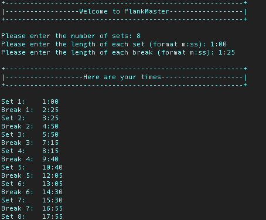

# PlankMaster

## Description:
- PlankMaster will help you in timing a plank workout based on three parameters:
    1. Number of sets
    2. Length of each set
    3. Length of each break
- With the output given, you will be able to complete the workout with just a stopwatch!

## Installation & Usage:
1. Clone the repository
2. Run the following command:
```
python3 plankmaster.py
```

## Example Output:

